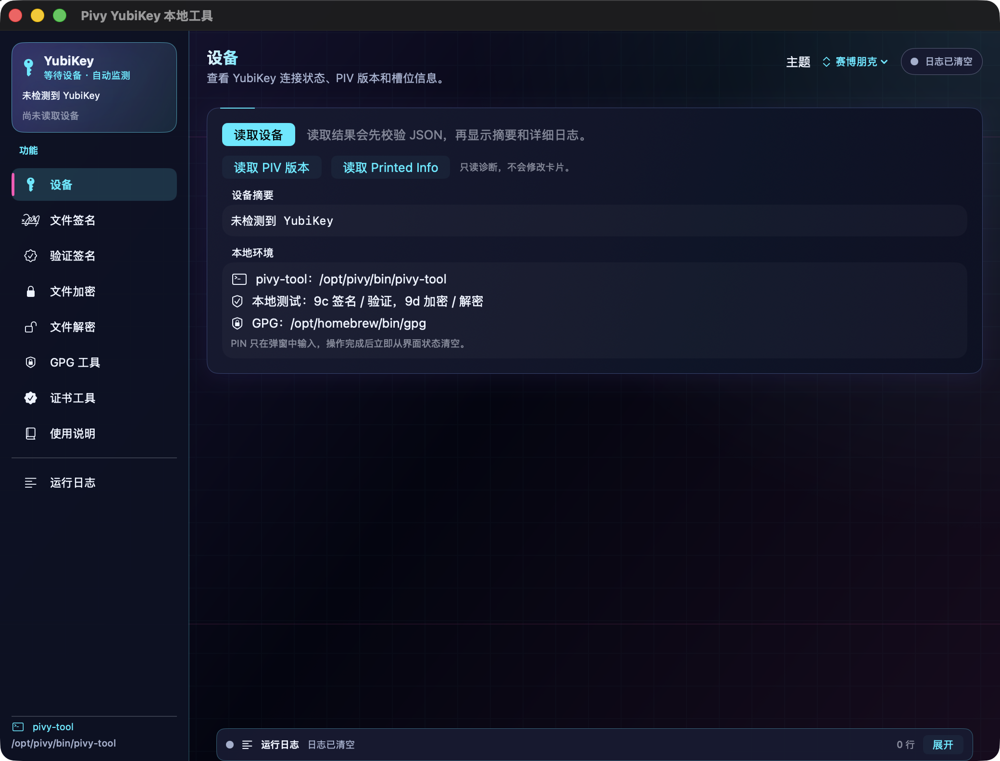

# Pivy YubiKey 本地工具

一个面向 macOS 的 YubiKey PIV/OpenPGP 图形界面工具。它把 pivy-tool、GnuPG 和 macOS 的智能卡能力集中到一个窗口中，适合本地演示、日常文件签名/加密，以及服务器证书准备。

> 本项目是 GUI 壳，不替代 YubiKey 固件。PIV 私钥仍留在 YubiKey 内；GPG 大文件由电脑上的 GnuPG 处理，YubiKey 负责需要保护的私钥操作。

## 功能总览

### PIV

- **设备**：读取 YubiKey、阅读器、序列号、PIV 版本和 9a/9c/9d/9e 槽位摘要。
- **文件签名**：用 9c 对小文件生成分离签名 .sig，同时导出 .sig.cert.pem 证书。
- **验证签名**：拖入原文件、.sig 和 .sig.cert.pem，程序会按后缀自动归类并验证。
- **文件加密/解密**：用 9d 生成和解开 .pivybox；原文件不会被覆盖。
- **证书工具**：选择槽位，导出公钥、证书、槽位证明，或生成服务器认证用 CSR。
- **9a 诊断**：用卡内 9a 私钥做往返认证，帮助发现公钥与私钥不匹配的问题。

### GPG / OpenPGP

- 任意大小文件的 OpenPGP 加密、解密、分离签名和签名验证。
- 保存多个收件人的公钥；加密时选择对方公钥，而不是误用自己的签名身份。
- 支持同时加密给自己，方便发送文件后保留可解密的本地副本。
- 读取 OpenPGP 卡状态、公钥、私钥索引和主密钥/子密钥结构。
- 提供在 YubiKey 上生成密钥、把已有子密钥迁移到卡片、导出/复制公钥和发布公钥的向导。

### 使用体验

- 插入或拔出 YubiKey 后自动监测并更新左上角状态。
- 日志固定在窗口底部，可展开、收起、复制、保存或清空；新日志自动滚动到最底部。
- PIN 只通过系统弹窗输入，不写入日志；失败时保留界面，不自动退出。
- 主题支持赛博朋克、浅色、深色和跟随系统。
- “使用说明”会检查依赖，只显示当前缺少的安装项。

## 重要边界：什么时候用 PIV，什么时候用 GPG

| 需求 | 推荐功能 | 说明 |
| --- | --- | --- |
| 服务器 SSH/证书认证 | PIV 9a + 证书/公钥/CSR | 服务器保存公钥或 CA 签发的证书，私钥留在卡内 |
| 小文件完整性证明 | PIV 9c | 受 pivy-tool 输入大小限制，适合配置、文本和小型文件 |
| 小文件的卡内加密演示 | PIV 9d | 产生 .pivybox，必须用支持该格式的 Pivy 工具解密 |
| 大图片、大文档、归档文件 | GPG | 文件本体由电脑处理，YubiKey OpenPGP 私钥用于解密/签名 |
| Git commit/tag 签名 | GPG 签名子密钥 | Git 调用 GnuPG 生成可验证的提交签名 |
| 9e 卡片认证 | PIV 9e | 通常由企业卡片系统或专用协议使用，个人日常很少直接操作 |

PIV 的 9a/9c/9d/9e 是四个用途不同的 PIV 槽位，和 YubiKey 的 OpenPGP/GPG 应用是两套独立体系。PIV 证书不能直接当成 GPG 公钥，GPG 密钥也不会自动出现在 PIV 槽位中。

## 安装

### 依赖

- macOS
- 一把支持 CCID 的 YubiKey
- PIV 功能：pivy-tool
- GPG 功能：GnuPG 和 pinentry-mac
- CSR/证书相关操作：OpenSSL

如果电脑没有 Homebrew，先按终端提示安装：

~~~bash
/bin/bash -c "$(curl -fsSL https://raw.githubusercontent.com/Homebrew/install/HEAD/install.sh)"
~~~

安装依赖：

~~~bash
# PIV：安装 pivy-tool、pivy-box 等组件
brew install --cask pivy-app

# GPG/OpenPGP 和 macOS PIN 弹窗
brew install gnupg pinentry-mac

# CSR/证书工具需要 OpenSSL；macOS 自带版本通常也可用
brew install openssl@3
~~~

如果只想使用 PIV，不必安装 GPG；如果只想使用 GPG，也不必把 PIV 证书导入 OpenPGP 卡。

### 构建和启动

~~~bash
git clone https://github.com/pd5200/pivy-shell.git
cd pivy-shell
./build.sh
open PivyShell.app
~~~

也可以直接打开已构建的 PivyShell.app。第一次使用时进入“使用说明”，程序会显示实际检测到的工具路径和缺少的组件。

### 下载已发布版本

以后可以直接从 [GitHub Releases](https://github.com/pd5200/pivy-shell/releases) 下载带有版本号的 macOS Universal 压缩包。它同时包含 Apple Silicon 和 Intel 两种架构，下载后解压即可打开 PivyShell.app；首次运行可能需要在“系统设置 → 隐私与安全性”中允许运行。

Release 只提供应用本体，不会把 pivy-tool、GnuPG 或 PIN 弹窗一起打包。根据需要打开应用的“使用说明”页安装依赖，并用压缩包旁边的 .sha256 文件校验下载完整性。

## 自动构建和发布

仓库中的 .github/workflows/macos-release.yml 会在以下情况运行：

- 推送 v 开头的版本标签，例如 v0.12.0；
- 在 GitHub Actions 页面手动运行，并填写版本标签。

Action 使用 GitHub 的 macOS runner 构建 Universal App，生成：

~~~text
PivyShell-<版本>-macOS-universal.zip
PivyShell-<版本>-macOS-universal.zip.sha256
~~~

构建成功后会自动创建或更新对应的 GitHub Release。以后发布新版本只需要先修改代码和 Info.plist 版本号，然后提交、推送并创建标签：

~~~bash
git add .
git commit -m "Prepare next release"
git push origin main
git tag v0.12.0
git push origin v0.12.0
~~~

也可以不在本地创建标签，直接到仓库的 Actions 页面运行 “Build macOS release”，填写要发布的标签。

## 第一次使用

1. 安装所需依赖并插入 YubiKey。
2. 打开“设备”，等待左上角从“等待设备”变为已连接，然后点击“读取设备”。
3. 需要 PIV 时，确认 9a/9c/9d/9e 槽位和证书用途；需要 GPG 时，进入“GPG 工具 → 密钥与卡片”，读取 OpenPGP 卡。
4. 执行签名、解密或卡内密钥操作时，在弹出的 PIN 窗口输入 PIN，并按系统提示触摸 YubiKey。
5. 任何失败都先看底部“运行日志”。窗口不会因为单个文件或设备错误而关闭。

插拔状态由程序自动监测。如果底层 CCID 被其他程序占用，先关闭 Yubico Authenticator、GPG 终端会话等读卡程序，再点击“读取设备”。应用也会尝试释放 GPG 的 scdaemon 会话并重试。

## PIV 操作流程

### 9c 文件签名和验证

签名输出两个文件：

~~~text
报告.pdf.sig
报告.pdf.sig.cert.pem
~~~

把这三个文件交给对方：原文件、.sig、.sig.cert.pem。对方在“验证签名”页面分别拖入三个区域即可。验证结果表示“文件内容没有被修改，且签名与该证书匹配”；如果证书是自签名证书，还需要通过其他可信渠道核对证书指纹，不能仅凭文件名判断身份。

### 9d 文件加密和解密

9d 的 .pivybox 是 Pivy 专用格式，只适合小文件演示。PIV 槽位本身不是通用的大文件加密引擎，图片或大型文档应使用 GPG 页面。

~~~text
原文件 → 9d 加密 → 原文件.pivybox → 9d 解密 → 原文件.decrypted
~~~

### 9a 服务器认证和 CSR

服务器认证通常使用 9a：

1. 在“证书工具”选择 9a 槽位。
2. 在卡内生成密钥或使用已有密钥。
3. 导出公钥，或生成 CSR 交给企业 CA/服务器管理系统签发证书。
4. 服务器保存公钥/证书；以后认证时，YubiKey 负责用 9a 私钥签名，私钥不会离开卡片。

CSR 不是私钥，也不是最终证书，而是“请 CA 根据这个公钥和身份信息签发证书”的申请文件。直接导出公钥适合服务器自己做公钥认证；需要标准证书链时使用 CSR。

## GPG：公钥、主密钥和子密钥

### 最重要的概念

| 对象 | 作用 | 日常是否放在 YubiKey |
| --- | --- | --- |
| 主密钥（Primary key） | 代表你的长期身份，签署/管理子密钥 | 通常离线保存，不用于每天操作 |
| 签名子密钥（S） | 签署文件、Git commit/tag | 推荐放入卡片 |
| 加密子密钥（E） | 解密发给你的文件 | 推荐放入卡片 |
| 认证子密钥（A） | SSH/其他认证场景 | 按需放入卡片 |

加密使用**对方的 E 子密钥公钥**。对方用自己的 E 子密钥私钥解密。签名使用你的 S 子密钥私钥，对方用你的公钥验证。

主密钥不会自动“解开所有子密钥加密的文件”。能否解密取决于对应的 E 子密钥私钥是否还存在。主密钥主要负责证明身份、签署和管理子密钥；不要因为有主密钥就删除或丢弃旧的加密子密钥备份。

### 两种安全建立方式

应用的“GPG 工具”中新增了“本地生成”二级页：可以打开本地生成向导或复制完整步骤。向导会提醒先拔出 YubiKey、尽量断网，并保存加密私钥备份、撤销证书、主密钥指纹和公钥；姓名、邮箱、密码等敏感输入仍由 GnuPG 在 Terminal/PIN 弹窗中处理。

同一页还提供“迁移子密钥到 YubiKey”入口。这里不是导入 public-key.asc，而是使用 GnuPG 的 keytocard 将 S/E/A 私钥子密钥迁移到 YubiKey。迁移前必须先完成离线备份；迁移后主密钥继续留在离线环境中。

#### 方案 A：直接在 YubiKey OpenPGP 卡上生成

适合新建身份，私钥从生成时就留在卡上：

1. 安装 GnuPG 和 pinentry-mac。
2. 在“GPG 工具 → 密钥与卡片”点击“生成卡上密钥”。
3. 在 Terminal 向导中输入 admin，再输入 generate。
4. 按提示填写姓名、邮箱、PIN 和备份选项。
5. 回到应用点击“读取 OpenPGP 卡”和“读取公钥”，然后导出 .asc 公钥。

卡上生成的私钥通常不能从 YubiKey 导出，因此必须准备备用卡或离线备份方案。

#### 方案 B：电脑离线保管主密钥，再把子密钥迁移到卡

适合需要多张备用卡、离线主密钥和更完整密钥生命周期管理的场景：

1. 在离线、受保护的电脑上生成主密钥。
2. 用主密钥生成 S/E/A 子密钥。
3. 备份主密钥、子密钥和撤销证书，并核对指纹。
4. 在应用的“密钥管理”页打开“迁移已有子密钥”，用 GnuPG 的 keytocard 将选定子密钥写入 YubiKey。
5. 导出公钥，交给通信对象、Git 平台或服务器。

迁移到卡片后，GnuPG 通常会把对应的私钥标记为卡上私钥；不要在没有备份的情况下删除电脑上的密钥材料。主密钥应尽量离线保存，日常使用卡上的子密钥。

### 子密钥过期和密文

- 子密钥过期主要阻止它继续用于新的签名或加密，不会自动擦除历史密文。
- 只要旧 E 子密钥私钥仍在卡片或安全备份中，通常仍可解开以前发给它的密文。
- 轮换 E 子密钥后，新文件使用新公钥；旧文件仍需要保留旧 E 私钥才能解密。
- 因此不要只保留最新公钥，也不要在没有迁移/备份计划时删除旧加密子密钥。

### 多个收件人和公布公钥

应用可以在电脑上保存多个公钥。加密前在“收件人公钥库”中选择对方的邮箱或指纹；建议同时勾选“加密给自己”，否则你可能无法用自己的私钥打开发出前保存的密文。

公布公钥前先核对完整指纹。可以：

- 复制 ASCII-armored 公钥，放入邮件、网站或代码仓库；
- 导出 gpg-public-key.asc 文件；
- 发布到 OpenPGP 公钥服务器。公钥本身可以公开，但指纹仍应通过另一条可信渠道确认。

### 验证 VeraCrypt 官方下载文件

VeraCrypt 下载页会提供安装文件、对应的 `.sig` 签名和官方 PGP 公钥指纹。本工具的“GPG 工具 → 下载验证”页已经内置以下官方信息：

- 官方下载页：[veracrypt.jp/zh-cn/Downloads.html](https://veracrypt.jp/zh-cn/Downloads.html)
- 公钥地址：<https://amcrypto.jp/VeraCrypt/VeraCrypt_PGP_public_key.asc>
- 官方指纹：`5069 A233 D55A 0EEB 174A 5FC3 821A CD02 680D 16DE`

使用界面时按这个顺序操作：

1. 点击“打开 VeraCrypt 官方下载页”，从同一版本下载原文件和对应的 `.sig` 文件。
2. 进入“GPG 工具 → 下载验证”，点击“下载并校验公钥”。程序会先在 show-only 预览模式读取指纹，只有完全匹配官方指纹才会导入本机 GPG 公钥库。
3. 把原文件（例如 `.dmg`）拖入“VeraCrypt 原文件”，把对应的 `.sig` 拖入右侧区域。
4. 点击“验证 VeraCrypt 签名”。只有“签名数学有效”且“实际签名者的主密钥/签名密钥指纹匹配官方指纹”时才显示成功。

“签名数学上有效，但不是 VeraCrypt 官方密钥”必须视为失败；不能只看 GPG 输出中的 `Good signature` 或邮箱名称。下载、导入和验证都只在本机执行，不会自动安装 VeraCrypt。

命令行等价流程如下，适合排查 GUI 或学习 GPG：

~~~bash
curl -fsSL \
  https://amcrypto.jp/VeraCrypt/VeraCrypt_PGP_public_key.asc \
  -o VeraCrypt_PGP_public_key.asc

# 先预览指纹，不修改本机密钥库
gpg --batch --with-colons \
  --import-options show-only \
  --import VeraCrypt_PGP_public_key.asc

# 只在核对到 5069A233D55A0EEB174A5FC3821ACD02680D16DE 后导入
gpg --import VeraCrypt_PGP_public_key.asc

# 原文件和 .sig 必须来自同一个官方版本
gpg --status-fd 1 --verify VeraCrypt-文件.sig VeraCrypt-文件
~~~

## GPG PIN 弹窗异常

如果出现 Screen or window too small、PIN 窗口不出现或 gpg/card> 卡住：

1. 在 gpg/card> 输入 q 退出卡片编辑。
2. 在普通 Terminal 执行：

   ~~~bash
   mkdir -p ~/.gnupg
   printf '%s\n' 'pinentry-program /opt/homebrew/bin/pinentry-mac' >> ~/.gnupg/gpg-agent.conf
   gpgconf --kill gpg-agent
   ~~~

   Intel Mac 可将路径改为 /usr/local/bin/pinentry-mac；也可以使用更通用的 $(brew --prefix)/bin/pinentry-mac。
3. 重新打开 GPG 操作。PIN 应由 pinentry-mac 弹窗接管，而不是在 GUI 或日志中输入。

这几条命令只配置 GPG Agent 的 PIN 弹窗并重启 Agent，不会清空 OpenPGP 卡，也不会修改 PIV 槽位。

## 常见问题

### no PIV cards/tokens found

通常是 CCID 被 GPG scdaemon、Yubico Authenticator 或其他智能卡程序占用。关闭这些程序后重新插拔 YubiKey，再点击“读取设备”。也可以在“使用说明 → 读卡冲突处理”点击释放会话；命令行等价于：

~~~bash
gpgconf --kill scdaemon
~~~

### 返回内容不是有效的 PIV JSON

这是底层工具没有返回可解析的设备信息，常见原因是读卡会话刚切换、设备刚插拔或 CCID 被占用。应用会自动重试一次；如果仍失败，重新插入 YubiKey，再执行“读取设备”。

### 9a 出现 incorrect signature

这表示卡内 9a 私钥签出的结果无法用当前 9a 公钥验证。常见原因是私钥曾被重新生成但证书/公钥没有同步，或底层工具存在 ECDSA 兼容问题。先独立验证：

~~~bash
ykman piv keys export 9a - --verify
~~~

确认失败后再重新生成 9a 密钥和证书，并同步更新服务器公钥。不要把 factory-reset 或 ykman piv reset 当作普通修复命令。

### 为什么 PIV 加密/签名提示大小限制

PIV 槽位适合“私钥运算”，不是用来直接吞吐任意大小文件的对称加密引擎。当前 GUI 使用的 pivy-tool box 对输入大小有上限，超过时会提示并保留界面；大文件请切换到 GPG。

## 安全提醒

- 永远不要把 PIN、PUK、管理密钥写入脚本、截图或日志。
- 生成或更换 OpenPGP 密钥前，先导出旧公钥、记录指纹，并确认有备用卡或离线备份。
- 不要在本工具中执行 factory-reset 或 ykman piv reset。这些是清空/重置卡片的高风险操作，不是普通读卡故障修复。
- PIV 和 OpenPGP 是独立应用：重置 PIV 不等于重置 GPG，反之亦然；但任何卡片级重置前都应先确认影响范围。
- 私钥丢失通常无法通过公钥恢复。发现 YubiKey 丢失时，应立即撤销/停用对应证书或 GPG 子密钥，并用备用密钥重新注册服务器、Git 和其他服务。

## 项目结构

~~~text
PivyShell.swift       macOS SwiftUI 主程序
GPGVerificationLogic.swift GPG 指纹解析和官方签名判定规则
Info.plist            App Bundle 信息
IconGenerator.swift   生成应用图标
build.sh              编译程序、生成图标并组装 PivyShell.app
docs/                 README 使用截图
Tests/                纯规则测试
README.md             使用、安装和安全说明
~~~

## 开发

~~~bash
./build.sh
swiftc -parse-as-library GPGVerificationLogic.swift Tests/GPGVerificationTests.swift -o /tmp/pivy-gpg-verification-tests
/tmp/pivy-gpg-verification-tests
git diff --check
~~~

构建会在项目目录生成 PivyShell.app。这是本地开发构建，未进行 Apple Developer ID 签名或公证；首次打开时 macOS 可能需要在“系统设置 → 隐私与安全性”允许运行。

## 许可证

当前仓库未附加独立许可证文件；如需对外分发，请先补充许可证并确认 pivy-tool、GnuPG 及其他依赖的各自许可条款。
